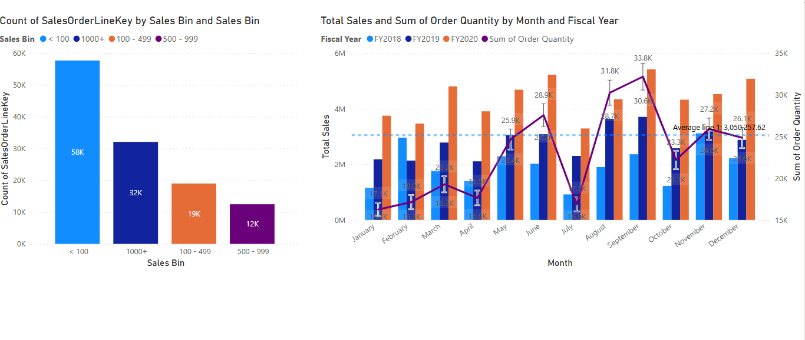
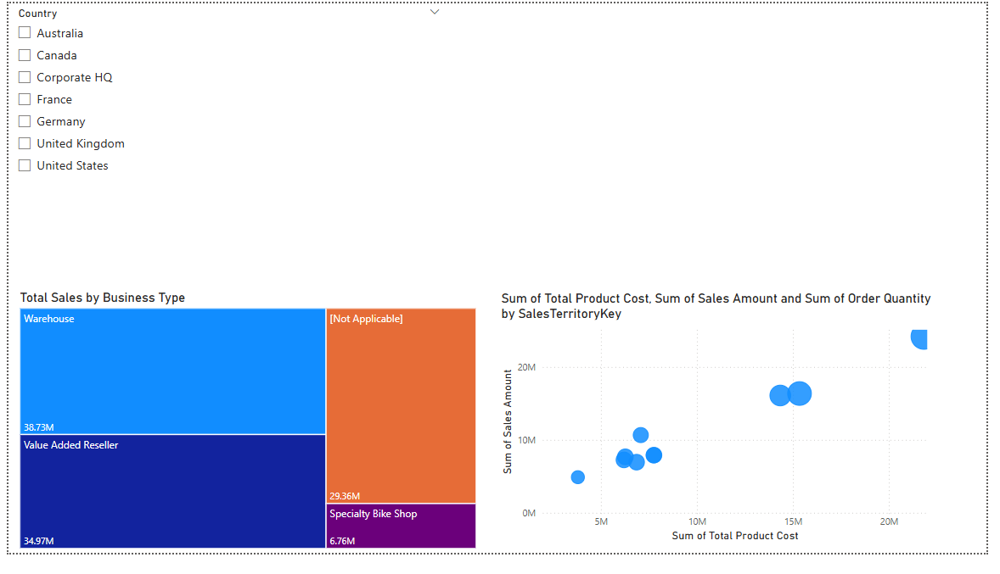
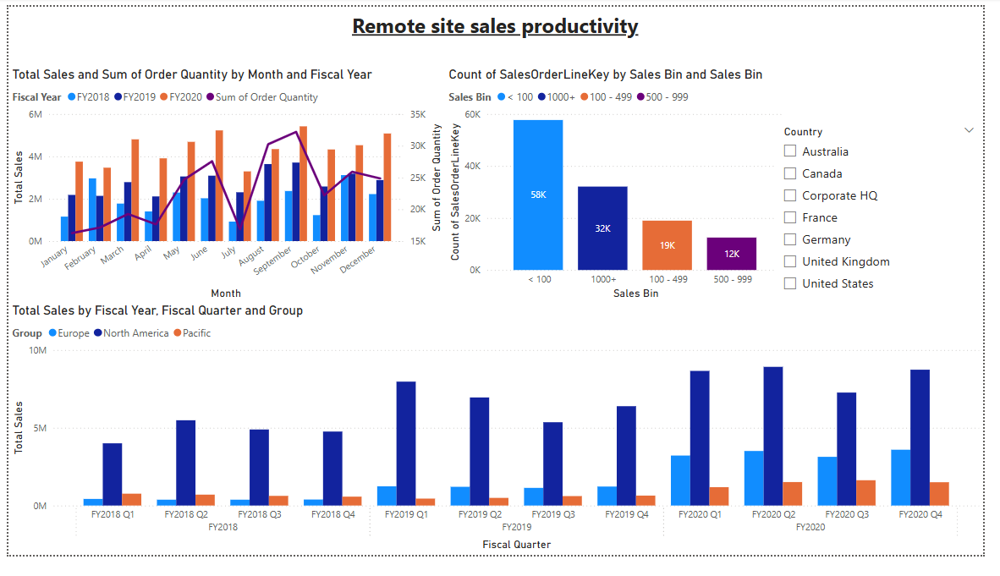

# 📊 Remote Site Sales Productivity Analysis – Power BI Project

This project presents a comprehensive **Power BI dashboard** designed to analyze and visualize sales productivity across various remote sites over multiple fiscal years. The report leverages advanced DAX functions, calculated measures, and visual analytics to reveal performance trends and operational insights.

## 🚀 Project Highlights

- ✅ **Time-series analysis** of total sales and order quantity across months and fiscal years.
- ✅ **Sales performance categorization** using custom-defined sales bins.
- ✅ **Regional sales comparison** across groups (Europe, North America, Pacific).
- ✅ **Drilldown-ready visuals** with slicers for country-level filtering.
- ✅ **Interactive and dynamic visuals** powered by DAX measures and calculated tables.

---

## 📈 Final Report Snapshot

---

## 🛠️ Steps to Build the Dashboard

### 1. **Data Collection and Preparation**
- Imported sales and order data from relevant sources (CSV, Excel, or database).
- Cleaned and structured data using Power Query Editor.
- Ensured correct data types and created relationships between tables.

### 2. **Data Modeling**
- Created a star schema for performance optimization.
- Defined relationships between:
  - **Sales** table
  - **Date** table
  - **Geography / Country** table

### 3. **DAX Measures & Calculated Columns**
- `Total Sales` = `SUM(Sales[SalesAmount])`
- `Order Quantity` = `SUM(Sales[OrderQuantity])`
- `Sales Bin` column to classify sales volume (e.g., <100, 100–499, etc.)
- `SalesOrderLineKey Count` by bin to measure frequency distribution

### 4. **Visualization Design**
- **Monthly Sales Trend**:
  - Combined bar (sales) and line (quantity) chart grouped by fiscal year.
- **Sales Bin Distribution**:
  - Bar chart categorizing orders into bins: `<100`, `100–499`, `500–999`, `1000+`.
- **Quarterly Sales by Region**:
  - Stacked bar chart breaking down sales per fiscal quarter and regional group.
- **Slicer Filters**:
  - Country selector to enable interactive filtering by location.

### 5. **User Experience Enhancements**
- Applied consistent color themes for clarity.
- Added data labels and legends for better interpretability.
- Enabled cross-filtering among visuals for interactive insights.

---

## 📚 Key Learnings and Outcomes

- Demonstrated the power of DAX for dynamic analysis and measure creation.
- Showcased effective use of time intelligence for fiscal tracking.
- Enhanced stakeholder decision-making with an intuitive, interactive report.

---

## 🧩 Tools & Technologies

- **Power BI Desktop**
- **Power BI Service**
- **DAX (Data Analysis Expressions)**
- **Power Query**
- **Data modeling best practices**

---

## 🗃️ Future Improvements

- Integrate Time intelligence measure to perform period to period comparison and compute moving sales
- Online Shared Power BI service shared with member of the tenant: [Project dashboard](https://maester-khris.github.io/)